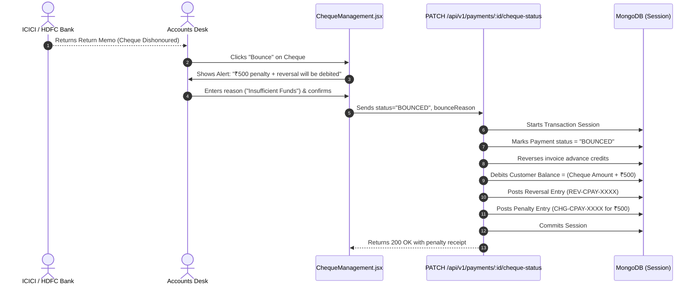
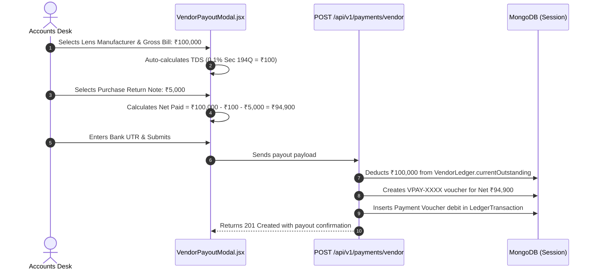

# DigiWholesale Enterprise Accounting & Payment API Documentation & Flow Guide

This document provides a comprehensive reference for all newly created Accounting, Payment, Ledger, and Aging APIs. It details **where to use each API**, **exact payloads**, **expected responses**, and **step-by-step business workflows**.

---

## 1. API Summary & Screen Mapping

All accounting endpoints are mounted under `/api/v1/*` (with backward-compatible `/api/*` aliases).

| # | HTTP Method | Endpoint | Purpose / Feature | Frontend Screen / Component |
|---|---|---|---|---|
| 1 | `POST` | `/api/v1/payments/customer` | Customer Inflow & Multi-Invoice Split | `CustomerPaymentModal.jsx` |
| 2 | `PATCH` | `/api/v1/payments/:id/cheque-status` | Cheque Clearance & Bounce (₹500 Penalty) | `ChequeManagement.jsx` |
| 3 | `POST` | `/api/v1/payments/vendor` | Vendor Payout (TDS & Debit Note Settled) | `VendorPayoutModal.jsx` |
| 4 | `GET` | `/api/v1/payments` | Payment & Voucher Register Listing | `PaymentList.jsx` |
| 5 | `GET` | `/api/v1/payments/:id` | Single Voucher Detail / Receipt Slip | `PaymentList.jsx` |
| 6 | `GET` | `/api/v1/ledgers/customers` | Customer Khatas List & Summary Metrics | `CustomerLedgers.jsx` |
| 7 | `GET` | `/api/v1/ledgers/customer/:customerId` | Full Customer Khata Statement with Running Balance | `CustomerKhataStatement.jsx` |
| 8 | `POST` | `/api/v1/ledgers/customer/upsert` | 3-Tab Customer Master Financial Settings | `CustomerLedgers.jsx` (Modal) |
| 9 | `GET` | `/api/v1/ledgers/vendors` | Vendor Ledgers List & Payable Metrics | `VendorLedgers.jsx` |
| 10 | `GET` | `/api/v1/ledgers/vendor/:vendorId` | Full Vendor Payable Statement | `VendorStatement.jsx` |
| 11 | `POST` | `/api/v1/ledgers/vendor/upsert` | 3-Tab Vendor Master Financial Settings | `VendorLedgers.jsx` (Modal) |
| 12 | `GET` | `/api/v1/accounts/tree` | Hierarchical Chart of Accounts (COA) Tree | `ChartOfAccounts.jsx` |
| 13 | `GET` | `/api/v1/accounts` | Flat Accounts Listing with Filters | `ChartOfAccounts.jsx` |
| 14 | `POST` | `/api/v1/accounts` | Create New COA Account | `ChartOfAccounts.jsx` (Modal) |
| 15 | `PUT` | `/api/v1/accounts/:id` | Update Account Properties | `ChartOfAccounts.jsx` (Modal) |
| 16 | `GET` | `/api/v1/reports/aging` | 30/60/90/120+ Days Aging Breakdown | `AgingReport.jsx` |

---

## 2. Detailed API Specifications

### 2.1 Customer Inflow Payment Execution
- **Endpoint**: `POST /api/v1/payments/customer`
- **When to Use**: When a customer pays by Cash, UPI, Cheque, or Bank Transfer against one or multiple pending orders, or makes an advance payment.
- **Header**: `Authorization: Bearer <token>`
- **Request Body**:
```json
{
  "customerId": "66c8a1b2e4b0a1a2c3d4e5f6",
  "branchId": "66c8a1b2e4b0a1a2c3d4e5f7",
  "amount": 50000,
  "paymentMode": "UPI", // "UPI" | "CASH" | "CHEQUE" | "BANK_TRANSFER"
  "allocations": [
    {
      "invoiceId": "66c8b2c3d4e5f6a1b2c3d4e8",
      "invoiceNumber": "ORD-2026-001",
      "invoiceTotal": 20000,
      "allocatedAmount": 20000
    },
    {
      "invoiceId": "66c8b2c3d4e5f6a1b2c3d4e9",
      "invoiceNumber": "ORD-2026-002",
      "invoiceTotal": 15000,
      "allocatedAmount": 15000
    }
  ],
  "paymentDetails": {
    "utrNumber": "123456789012",
    "receiverUpiId": "digioptics@icici",
    "chequeNumber": "452101",
    "bankName": "HDFC Bank",
    "chequeDate": "2026-08-27",
    "cashVoucherNo": "CV-1082",
    "remarks": "Part payment via UPI"
  }
}
```
- **Success Response (201 Created)**:
```json
{
  "success": true,
  "message": "Customer payment processed successfully.",
  "data": {
    "_id": "66c8c3d4e5f6a1b2c3d4e510",
    "paymentNumber": "CPAY-1724738400000-845",
    "type": "CUSTOMER_INFLOW",
    "partyId": "66c8a1b2e4b0a1a2c3d4e5f6",
    "partyModel": "Customer",
    "partyName": "Vision Care Opticians",
    "paymentMode": "UPI",
    "grossAmount": 50000,
    "netAmountPaid": 50000,
    "allocations": [
      { "invoiceNumber": "ORD-2026-001", "allocatedAmount": 20000 },
      { "invoiceNumber": "ORD-2026-002", "allocatedAmount": 15000 }
    ],
    "advanceAmount": 15000,
    "status": "COMPLETED"
  }
}
```
- **Business Rule Executed**:
  - Total allocated = ₹35,000.
  - Advance balance = ₹15,000 automatically credited to Customer Khata.
  - Customer Ledger `currentBalance` reduced by ₹50,000.
  - Immutable `Receipt` voucher added to `LedgerTransaction`.

---

### 2.2 Cheque Clearance & Bounce Lifecycle
- **Endpoint**: `PATCH /api/v1/payments/:id/cheque-status`
- **When to Use**: In Cheque Management dashboard to update the lifecycle of a cheque.
- **Header**: `Authorization: Bearer <token>`
- **Request Body (For Cheque Clearance)**:
```json
{
  "status": "CLEARED", // "DEPOSITED" | "CLEARED" | "BOUNCED"
  "clearanceDate": "2026-08-28"
}
```
- **Request Body (For Cheque Bounce)**:
```json
{
  "status": "BOUNCED",
  "bounceReason": "Insufficient funds in drawer account"
}
```
- **Success Response (200 OK)**:
```json
{
  "success": true,
  "message": "Cheque marked as BOUNCED. Penalty of ₹500 applied.",
  "data": {
    "payment": {
      "_id": "66c8c3d4e5f6a1b2c3d4e510",
      "paymentNumber": "CPAY-1724738400000-845",
      "status": "BOUNCED",
      "paymentDetails": {
        "chequeNumber": "452101",
        "bouncePenaltyDebited": 500,
        "bounceReason": "Insufficient funds in drawer account"
      }
    }
  }
}
```
- **Business Rule Executed**:
  - Reverses paid amounts on linked invoices.
  - Adds Cheque Amount + **₹500 Bounce Penalty** to customer ledger balance.
  - Generates 2 audit entries:
    1. `REV-CPAY-XXXX`: Gross cheque debit reversal.
    2. `CHG-CPAY-XXXX`: ₹500 bounce charge debit.

---

### 2.3 Vendor Outflow Payout Execution
- **Endpoint**: `POST /api/v1/payments/vendor`
- **When to Use**: When paying a lens manufacturer, lab, or supplier, factoring in TDS withholdings and Return/Debit Note deductions.
- **Request Body**:
```json
{
  "vendorId": "66c8d4e5f6a1b2c3d4e5f611",
  "branchId": "66c8a1b2e4b0a1a2c3d4e5f7",
  "grossAmount": 100000,
  "tdsDeducted": 100, // 0.1% under Section 194Q
  "tdsSection": "194Q",
  "debitNoteDeducted": 5000, // Deduct purchase return note
  "debitNoteIds": ["66c8e5f6a1b2c3d4e5f612"],
  "paymentMode": "BANK_TRANSFER",
  "paymentDetails": {
    "utrNumber": "AXISN26240091823",
    "bankName": "Axis Bank",
    "remarks": "Settlement for July lens batch"
  }
}
```
- **Success Response (201 Created)**:
```json
{
  "success": true,
  "message": "Vendor payout processed successfully.",
  "data": {
    "paymentNumber": "VPAY-1724738500000-312",
    "type": "VENDOR_OUTFLOW",
    "grossAmount": 100000,
    "tdsDeducted": 100,
    "debitNoteDeducted": 5000,
    "netAmountPaid": 94900,
    "status": "COMPLETED"
  }
}
```
- **Formula**:
  $$\text{Net Paid} = \text{Gross Amount} (100,000) - \text{TDS} (100) - \text{Debit Note} (5,000) = ₹94,900$$
  Vendor outstanding is reduced by full gross ₹100,000.

---

### 2.4 Customer Khata Statement
- **Endpoint**: `GET /api/v1/ledgers/customer/:customerId`
- **Query Params**:
  - `startDate` (e.g. `2026-08-01`)
  - `endDate` (e.g. `2026-08-31`)
  - `voucherType` (`Sales Invoice`, `Receipt`, `Debit Note`, `Credit Note`)
  - `page`, `limit`
- **Success Response (200 OK)**:
```json
{
  "success": true,
  "data": {
    "summary": {
      "customer": {
        "shopName": "Vision Care Opticians",
        "ownerName": "Rajesh Sharma",
        "mobile": "9876543210"
      },
      "ledgerMaster": {
        "ledgerCode": "CUST-LED-00124",
        "creditLimit": 100000,
        "creditDays": 30,
        "currentBalance": 45000,
        "ledgerStatus": "Active"
      },
      "statistics": {
        "openingBalance": 10000,
        "totalDebit": 85000,
        "totalCredit": 50000,
        "netMovement": 35000,
        "closingBalance": 45000
      }
    },
    "transactions": [
      {
        "transactionDate": "2026-08-05T10:00:00.000Z",
        "voucherType": "Sales Invoice",
        "referenceNumber": "ORD-2026-001",
        "debit": 20000,
        "credit": 0,
        "runningBalance": 30000,
        "narration": "Wholesale order invoicing"
      },
      {
        "transactionDate": "2026-08-20T14:30:00.000Z",
        "voucherType": "Receipt",
        "referenceNumber": "CPAY-1724738400000-845",
        "debit": 0,
        "credit": 20000,
        "runningBalance": 10000,
        "narration": "Payment received via UPI"
      }
    ]
  }
}
```

---

### 2.5 30/60/90/120+ Days Aging Report
- **Endpoint**: `GET /api/v1/reports/aging`
- **Query Params**:
  - `entityType`: `"Customer"` (Receivables) or `"Vendor"` (Payables)
  - `branchId` (Optional)
- **Success Response (200 OK)**:
```json
{
  "success": true,
  "data": {
    "reportType": "Accounts Receivable Aging",
    "asOfDate": "2026-08-27T05:30:00.000Z",
    "summary": {
      "totalOutstanding": 450000,
      "total0_30": 250000,
      "total31_60": 120000,
      "total61_90": 50000,
      "total90Plus": 30000,
      "partyCount": 18
    },
    "parties": [
      {
        "partyId": "66c8a1b2e4b0a1a2c3d4e5f6",
        "partyName": "Vision Care Opticians",
        "creditLimit": 100000,
        "creditDays": 30,
        "currentBalance": 45000,
        "bucket0_30": 20000,
        "bucket31_60": 15000,
        "bucket61_90": 10000,
        "bucket90Plus": 0
      }
    ]
  }
}
```

---

### 2.6 Chart of Accounts (COA) Tree
- **Endpoint**: `GET /api/v1/accounts/tree`
- **When to Use**: On Chart of Accounts page to render the interactive nested tree structure.
- **Success Response (200 OK)**:
```json
{
  "success": true,
  "data": {
    "tree": {
      "Asset": [
        {
          "accountCode": "1000",
          "accountName": "Assets",
          "accountNature": "Asset",
          "children": [
            {
              "accountCode": "1100",
              "accountName": "Current Assets",
              "children": [
                {
                  "accountCode": "1110",
                  "accountName": "Accounts Receivable (Trade Debtors)",
                  "isControlAccount": true,
                  "children": []
                },
                {
                  "accountCode": "1120",
                  "accountName": "Cash on Hand",
                  "isControlAccount": true,
                  "children": []
                }
              ]
            }
          ]
        }
      ],
      "Liability": [...],
      "Capital": [...],
      "Income": [...],
      "Expense": [...]
    },
    "totalAccounts": 18
  }
}
```

---

## 3. End-to-End Business Workflows

### Flow 1: Customer Inflow & Multi-Bill Split
```mermaid
sequenceDiagram
    autonumber
    actor Customer as Optician / Store
    actor Accountant as Accounts Desk
    participant UI as CustomerPaymentModal.jsx
    participant API as POST /api/v1/payments/customer
    participant DB as MongoDB (Session)

    Accountant->>UI: Selects Customer & enters ₹50,000
    UI->>Accountant: Fetches unpaid orders (e.g. Bill 1: ₹20k, Bill 2: ₹15k)
    Accountant->>UI: Clicks "Auto-Split"
    UI->>UI: Allocates ₹20k + ₹15k = ₹35k; Advance = ₹15k
    Accountant->>UI: Selects UPI / Cash / Cheque & Clicks Confirm
    UI->>API: Submits payment payload with allocations[]
    API->>DB: Starts MongoDB Transaction Session
    API->>DB: Creates Payment Voucher (CPAY-XXXX)
    API->>DB: Deducts ₹50k from CustomerLedger.currentBalance
    API->>DB: Inserts Receipt audit record in LedgerTransaction
    API->>DB: Commits Session
    API-->>UI: Returns 201 Created
    UI-->>Accountant: Displays Success & auto-updates Khata Statement
```

---

### Flow 2: Cheque Bounce Lifecycle & Penalty Rule


---

### Flow 3: Vendor Payout Settlement (Gross - Return - TDS)


---

## 4. Frontend Service Integration Guide (`accountingService.js`)

All frontend components import and consume APIs from `src/services/accountingService.js`:

```javascript
import {
  getAccountTree,
  createAccount,
  getCustomerLedgers,
  getCustomerStatement,
  upsertCustomerLedger,
  executeCustomerPayment,
  getVendorLedgers,
  getVendorStatement,
  upsertVendorLedger,
  executeVendorPayment,
  updateChequeStatus,
  getPaymentsList,
  getAgingReport
} from '../../services/accountingService';
```

### Route Map in Frontend

- `/accounting/chart-of-accounts` $\rightarrow$ Chart of Accounts Tree Hierarchy
- `/accounting/customer-ledgers` $\rightarrow$ Customer Khata Listing & 3-Tab Settings
- `/accounting/customer-statement/:customerId` $\rightarrow$ Party Khata Statement (Print/Excel)
- `/accounting/vendor-ledgers` $\rightarrow$ Vendor Payables & 3-Tab Settings
- `/accounting/vendor-statement/:vendorId` $\rightarrow$ Vendor Statement
- `/accounting/payments` $\rightarrow$ Unified Vouchers Register & Slips
- `/accounting/cheques` $\rightarrow$ Cheque Clearance & Bounce Manager
- `/accounting/aging-report` $\rightarrow$ 30/60/90 Days Aging Analysis
